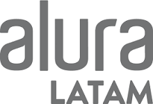
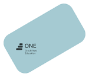

    

># **Primer Challenge - One Alura: Encriptador** :lock: :key:

______________________________________________________________

> En este encriptador podrás codificar el texto que quieras!!

> Si te arrepientes..puedes recuperar tu texto original.

> Que te diviertas encriptando!!

______________________________________________________________

  
                                                                
                                                                
                                                                

>## *Especificaciones* :

Desarrollado con HTML, CSS y Javascript
  
    
    

                                                                             
                                                                             
                                                                             
>## *Llaves de encriptación utilizadas:* :closed_lock_with_key:

* La letra "a" es convertida a "ai"

* La letra "e" es convertida a "enter"

* La letra "i" es convertida a "imes"

* La letra "o" es convertida a "ober"

* La letra "u" es convertida a "ufat

## *Acceso a la aplicación:* :link:

https://github.com/vivt1002/Challenge-1-Encriptador-One-Alura
